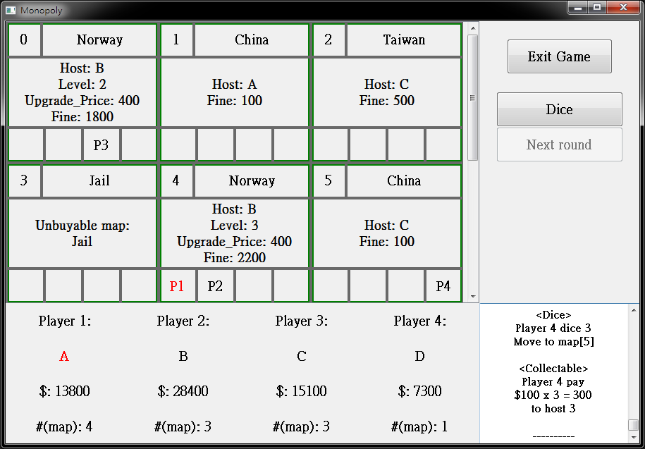

# Monopoly
An exercise of Monopoly game using Qt

# Compile
Tested in Qt 5.5 with MinGW 4.9.2 (32-bit)

## Usage
- Dice
- Next round
- Buy/Upgrade/Nothing
- clicking map will show the property

The `map.dat` stores all of maps.

## Screenshot

